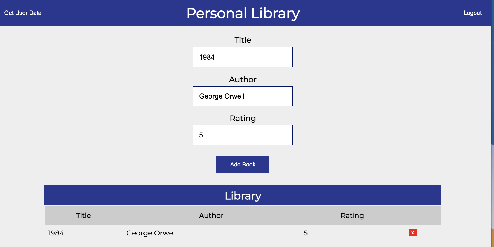

# personal-library

This project was to learn how to use Redux and Redux ToolKit. It is a simple application where you can add a book to the library.



|                                         |                                         |                                             |
| :-------------------------------------: | :-------------------------------------: | :-----------------------------------------: |
|        [Introduction](#book-app)        | [Table of Contents](#table-of-contents) | [Development Highlights](#personal-library) |
|      [Installation](#installation)      |    [Page Directory](#page-directory)    |    [Code Hightlights](#code-highlights)     |
| [Technologies Used](#Technologies-Used) |           [Credits](#Credits)           |             [License](#License)             |

## Installation

1. Install node modules

```
npm i
```

2. Start App

```
npm start
```

## Page Directory

The Redux code is inside the store directory. The store contains, actions, reducers, and slices.

## Code Highlights

Creating the bookSlice.

```JavaScript
const bookSlice = createSlice({
    name: 'books',
    initialState,
    reducers: {
        addBook: {
            reducer: (state, action) => {
                state.books.push(action.payload)
            },
            prepare: (value) => {
                return {
                    payload: {
                        ...value,
                        date: new Date(),
                        id: nanoid()
                    }
                }
            }
        },
        deleteBook(state, action) {
            state.books = state.books.filter(book => book.id !== action.payload.id)
        }
    }
})
```

## Technologies

### Frontend

- [HTML](https://www.w3schools.com/html/)
- [JavaScript](https://www.javascript.com/)
- [CSS](https://www.w3schools.com/css/)

### Frontend Framework/Library

- [ReactJS](https://reactjs.org/)
- [React-Redux](https://react-redux.js.org/)
- [Redux-Toolkit](https://redux-toolkit.js.org/)

## Credits

The project followed the  by Raul Terhes.
| | |
| ------------------------- | ----------------------------------------------------------------------------------------------------------------------------------------------------------------------------------------------------- |
| **David Anusontarangkul** | [ LinkedIn](https://www.linkedin.com/in/anusontarangkul/) [ GitHub](https://github.com/anusontarangkul) |

## License

[](https://opensource.org/licenses/MIT)
